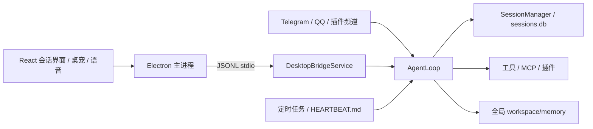

# Kaze（かぜ）

面向 Windows 的桌面智能助手，提供普通会话、共享长期记忆、工具调用（Tool Chain）、MCP、插件扩展、语音交互和可导入的动画桌宠。

Kaze 的每段对话使用独立的 `session_key`，消息记录分别保存，长期记忆统一位于工作区的 `memory/`。

## 桌面功能

| 入口 | 当前能力 |
| --- | --- |
| 对话 | 会话列表、附件、模型选择、流式生成与取消；发送首条消息时才创建会话，空白草稿重复点击“新会话”不会清空输入 |
| 工作台 | 搜索保存的消息、筛选会话与消息作者类型、分页、查看详情和 Tool Chain 工具执行记录与预览 |
| 知识与运行 | 直观查看全局记忆文档，以及 MCP、Skills 和定时任务信息 |
| 模型 | 添加、编辑、移除 API 模型连接；提供 Codex 的 ChatGPT 订阅登录入口 |
| 桌宠 | 手动导入 ZIP、选择桌宠、显示／隐藏、拖动、动画和回复气泡 |
| 语音与后台任务 | 配置语音输入／合成、热键、定时任务和基于 `HEARTBEAT.md` 的主动检查 |

工作台展示已持久化的会话记录与工具调用链路，支持长文本预览与结果追踪。当前工作台侧重于查看历史、工具链路及执行状态，不提供工作台内的消息直接编辑、撤销和删除。

模型连接保存或默认模型切换会重启后端会话服务，回复期间请等待完成再修改。Codex 集成的真实账号授权与远程推理说明，详见 [Codex 连接说明](docs/codex-connection.md)。

## 当前架构



- 会话直接使用 `session_key`，桌面 RPC 也接受 `chat_id`。新桌面会话默认生成 `desktop:<uuid>`；外部频道使用 `<channel>:<chat_id>`。会话间消息记录独立，长期记忆共享。
- 系统采用通用 Agent 会话机制，会话状态与长期记忆解耦管理。
- `workspace/memory/` 存放 Markdown 长期记忆、历史、待整理内容及近期上下文。可选语义记忆插件使用全局索引。
- 桌宠包统一放在 `workspace/pets/`。桌宠选择属于应用，可在不同会话中使用；支持导入、切换、显示、隐藏、拖动、动画和回复气泡。
- 语音使用全局 `[voice.tts].voice_id`，热键输入发送到当前会话。模型目录的第一个注册项为全局主模型。
- 定时任务按 `session_key` 归属。普通主动检查读取工作区 `HEARTBEAT.md`，设置中的“高级”可以配置会话和间隔；配置文件还支持外部频道目标。

核心入口：`apps/backend/bootstrap/tools.py`；会话桥接：`apps/backend/desktop_bridge/session_service.py`；前端入口：`apps/desktop/renderer/src/SessionApp.tsx`。

## Windows 开发

需要 Python 3.12+、Node.js 和 pnpm（项目声明版本为 `10.33.0`）。以下命令在仓库根目录的 PowerShell 中执行。开发版默认使用仓库下的 `workspace/`；安装版使用 `%USERPROFILE%\.hasaki\workspace`。配置文件位于对应工作区的 `config.toml`。可通过 `HASAKI_WORKSPACE` 显式指定其他工作区。

```powershell
python -m venv .venv
.venv\Scripts\python.exe -m pip install -r apps/backend/requirements/development.txt
pnpm install
node apps/desktop/node_modules/electron/install.js
pnpm start  # 先构建最新代码，再启动本仓库 Electron
```

首次启动后，在“模型”页配置可用连接；示例配置中的占位密钥不能用于对话。语音服务需另行在设置中配置。根包名为 `kaze-agent`，桌面包名为 `kaze-desktop`；仓库文件夹可以保留原名，不影响启动。

外部频道的发送者白名单在工作区 `channels.json`，例如 `{"allow_from":{"telegram":["123456"]}}`；默认不接收未授权发送者。

工作区包含个人对话及配置，不纳入版本控制。Codex 连接凭据单独保存在工作区 `.desktop/codex-auth.bin`，Windows 使用当前用户的 DPAPI 加密；迁移到其他 Windows 用户后需要重新授权。

## 桌宠与品牌资源

软件图标及助手头像使用坐姿小风鼬，顶部导航使用蓝色风纹图标。桌宠由用户通过界面手动导入 ZIP，不随源码自动导入或选中。

原尺寸小风鼬的源文件位于 [assets/pets/kaze-wind-ferret](assets/pets/kaze-wind-ferret)。将 `pet.json` 与 `spritesheet.webp` 放在 ZIP 根目录即可导入：

```powershell
New-Item -ItemType Directory -Force output/pets | Out-Null
Compress-Archive -Path assets/pets/kaze-wind-ferret/pet.json,assets/pets/kaze-wind-ferret/spritesheet.webp -DestinationPath output/pets/kaze-wind-ferret.zip -Force
```

本地生成的 `output/` 预览和 ZIP 不包含在源码仓库中。更多制作记录见 [桌宠说明](docs/kaze-pet.md) 和 [品牌资源说明](docs/kaze-branding.md)。

## 验证与测试

```powershell
pnpm typecheck
pnpm build
pnpm test
./scripts/test-session-runtime.ps1

# Codex 连接的模拟认证与模型调用测试
$env:PYTHONPATH = "apps/backend"
.venv\Scripts\python.exe -m pytest tests/backend/test_codex_connection.py -q

# Windows 打包流程检查
pnpm --filter kaze-desktop run test:package
```

回归测试覆盖普通会话身份、共享 Markdown 记忆、消息持久化、并发串行化、取消、定时推送、JSONL 中文通信、桌宠包与图集验证，以及保留的语音、屏幕观察和调度时间测试。真实模型、云语音和安装包仍需结合实际环境进行交互验收。

构建 Windows 安装包使用 `pnpm --filter kaze-desktop run package:win`。

## 启动隔离

应用显示名为 Kaze。Windows App ID 为 `com.hasaki.agent`。在申请单实例锁之前设置独立的 `userData` 和 `sessionData`，缓存位于工作区 `.desktop/user-data/chromium/`，按工作区隔离缓存与实例。

启动路径诊断记录在工作区 `.desktop/user-data/desktop-diagnostics.log` 的 `runtime.paths` 事件中，包含实际后端程序、工作目录和缓存目录。`HASAKI_DESKTOP_USER_DATA_DIR` 可显式覆盖桌面数据目录。

## 开源许可证 (License)

本项目采用 [MIT 许可证](LICENSE)。

第三方资源与组件许可：
- **字体**：霞鹜文楷（LXGW WenKai），遵循 [SIL Open Font License 1.1](apps/desktop/renderer/public/licenses/OFL-LXGW-WenKai.txt)。
