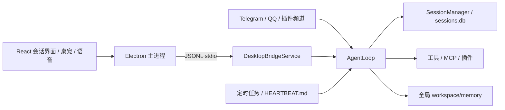

# Akashic Windows 会话版

本项目保留 Electron Windows 桌面壳、桌宠、语音、工具、MCP 和插件，将原来的角色运行架构改成普通会话。行为目标参考 `E:\CODE\akashic_agent`；并非该仓库的逐文件移植。

## 当前架构



- 会话直接使用 `session_key`，桌面 RPC 也接受 `chat_id`。新桌面会话默认生成 `desktop:<uuid>`；外部频道使用 `<channel>:<chat_id>`。会话间消息记录独立，长期记忆共享。
- 不再加载 `RoleRepository`、角色运行时或 `roles.json`，不创建角色目录，不进行角色切换、情绪评分、关系评分、表情差分或剧情生成。
- `workspace/memory/` 存放 Markdown 长期记忆、历史、待整理内容及近期上下文。可选语义记忆插件使用全局索引；旧数据库中的兼容字段不再决定角色隔离。
- 桌宠包统一放在 `workspace/pets/`。桌宠选择属于应用，可在不同会话中使用；支持导入、切换、显示、隐藏、拖动、动画和回复气泡。
- 语音使用全局 `[voice.tts].voice_id`，热键输入发送到当前会话。模型目录的第一个注册项为全局主模型。
- 定时任务按 `session_key` 归属。普通主动检查读取工作区 `HEARTBEAT.md`，设置中的“高级”可以配置会话和间隔；配置文件还支持外部频道目标。

核心入口：`apps/backend/bootstrap/tools.py`；会话桥接：`apps/backend/desktop_bridge/session_service.py`；前端入口：`apps/desktop/renderer/src/SessionApp.tsx`。

## Windows 开发

需要 Python 3.12+、Node.js 和 pnpm。从本仓库启动时，工作区固定为仓库下的 `workspace/`；安装版使用 `%USERPROFILE%\.hasaki\workspace`。配置文件位于对应工作区的 `config.toml`。两者均不复用旧 Shiori 的工作区或单实例锁。可通过 `HASAKI_WORKSPACE` 显式指定其他工作区。

```powershell
python -m venv .venv
.venv\Scripts\python.exe -m pip install -r apps/backend/requirements/development.txt
pnpm install
node apps/desktop/node_modules/electron/install.js
pnpm start  # 先构建最新代码，再启动本仓库 Electron
```

在设置中填写模型连接信息。外部频道的发送者白名单在工作区 `channels.json`，例如 `{"allow_from":{"telegram":["123456"]}}`；默认不接收未授权发送者。

## 旧数据迁移

若所选工作区包含旧角色数据，首次启动调用 `bootstrap/session_migration.py`。新的默认工作区不会自动读取或改写旧 `.shiori/workspace`：

1. 先备份已有 `sessions.db`，将 `role:*` 会话转成稳定的 `desktop:imported-*` 会话，保留消息 ID、原文和来源。
2. 旧 Markdown 记忆复制到全局 `memory/imports/`，长期事实、历史和待整理内容合并进全局文档。旧角色 `SELF.md` 仅归档，不作为新助手身份。
3. 复制桌宠包到全局目录；可在桌宠页面选择。迁移频道白名单和定时任务目标。
4. 写入 `migrations/plain-sessions-v1.json`，重复启动不重复合并。原始角色文件保留，不在运行时使用。

备份位于工作区 `migrations/before-plain-sessions-v1/`。迁移并不重新生成旧语义向量，旧数据库及其来源字段保留兼容。

## 验证

```powershell
pnpm typecheck
pnpm build
pnpm test
./scripts/test-session-runtime.ps1
```

新增回归覆盖普通会话身份、共享 Markdown 记忆、消息持久化、并发串行化、取消、定时推送、JSONL 中文通信、迁移幂等性、桌宠包与图集验证；同时运行保留的语音、屏幕观察和调度时间测试。

`tests/backend/` 中旧角色/Galgame 及部分旧桥接测试仍描述退役接口，不是本次回归命令的一部分，不能据此宣称旧后端全套测试通过。原代码和历史说明中有关角色系统的内容仅供迁移参考；移出的源文件临时备份在 `.tmp/removed-character-system/`。真实模型/云语音和安装包仍需交互验收。已在旧 Shiori 同时运行时验证本仓库 Electron 启动、普通会话后端健康检查及缓存隔离。原项目的自动更新检查已停用，以免覆盖会话版。

## 启动隔离

应用名为 `Hasaki Agent`，Windows App ID 为 `com.hasaki.agent`。在申请单实例锁之前设置独立的 `userData` 和 `sessionData`，缓存位于 `workspace/.desktop/user-data/chromium/`。开发启动和 `pnpm start` 使用相同的项目级配置，因此不会唤起 `E:\shirori\Shiori` 中的旧安装版。

启动路径诊断记录在 `workspace/.desktop/user-data/desktop-diagnostics.log` 的 `runtime.paths` 事件中，包含实际后端程序、工作目录和缓存目录。`HASAKI_DESKTOP_USER_DATA_DIR` 可显式覆盖桌面数据目录；旧 `SHIORI_*` 桌面环境变量不再影响 Hasaki。

## 桌面界面

界面采用 Akashic 的纸感配色与霞鹜文楷屏幕字体，包含对话、工作台、知识与运行、模型四个主入口；右上角保留桌宠、额外设置、主题切换和 Windows 窗口控制。

- 启动进入空白草稿。空白状态重复点“新会话”保留输入和附件，不写入会话记录；从已有会话点“新会话”返回空白，发送首条消息时才创建记录并生成标题。桌宠语音使用同一个草稿地址。
- 工作台支持消息搜索、会话与消息类型筛选、分页及消息详情。知识页只读展示全局 `MEMORY.md`、`SELF.md`、`HISTORY.md`，以及当前 MCP、Skills 和定时任务。
- 模型连接可添加、编辑、移除，输入条可切换全局默认模型。保存模型会重启后端，回复期间禁止切换；现有语音、频道、记忆和高级设置仍位于“设置”。
- 字体来自本地 Akashic 参考项目，未修改；随构建附带 `licenses/OFL-LXGW-WenKai.txt`。
