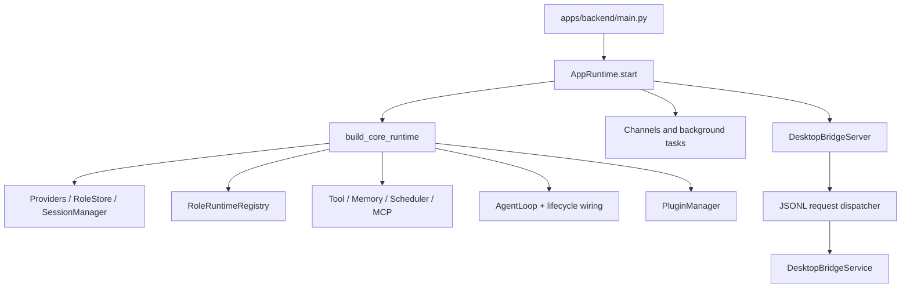
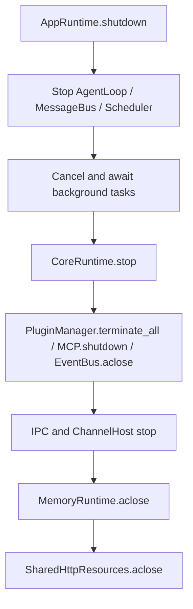

# 当前后端架构基线

本文记录 Python backend 的实际运行边界。`EXTRACTED` 表示源码或测试直接证明，`INFERRED` 表示由多个调用点推断，`AMBIGUOUS` 表示仍需运行 trace 验证。

## 进程与装配

`apps/backend/main.py` 解析配置和 workspace，`apps/backend/bootstrap/app.py` 的 `AppRuntime.start()` 调用 `apps/backend/bootstrap/tools.py:build_core_runtime()` 装配 CoreRuntime。CoreRuntime 持有 AgentLoop、MessageBus、EventBus、ToolRegistry、SessionManager、Scheduler、LLMProvider、MemoryRuntime、RoleRuntimeRegistry、MCP 和 PluginManager。



事实依据：`apps/backend/main.py:93-112`、`apps/backend/bootstrap/app.py:74-255`、`apps/backend/bootstrap/tools.py:467-635`。

## Bridge 与消息入口

Electron main 通过 `apps/desktop/src/bridge/bridgeClient.ts` 启动 Python bridge，使用 stdin/stdout JSONL。`apps/backend/desktop_bridge/server.py` 负责解析请求、并发分发、串行写回 response/event，并在退出时关闭 dispatcher、service 和 writer。

桌面聊天的实际路径是 `DesktopBridgeService -> DesktopChatService -> AgentLoop.process_direct`，不保证先经过 `MessageBus`。因此旧版总体架构中“所有输入先进入 bus”的表述需要细化为：渠道输入通常经过 bus，DesktopBridge chat 可以直接进入 AgentLoop 的 role-scoped processing。

## RoleRuntime 与唯一角色会话

`RoleRuntimeRegistry` 按 `role_id` 缓存一个稳定 `RoleRuntime`。`RoleRuntime` 以角色为并发边界，使用一把 role-wide lock 串行化 passive turn、proactive tick、background task 和 role state 操作。`RoleExecutionContext` 校验 role、config version、thread、transport、source 和 work kind。

角色会话 key 为 `role:{role_id}`。角色与唯一活跃会话是同一生命周期边界，不存在独立的 Session Plugin 产品概念。角色删除先记录删除事件，再删除 role session，并级联清理角色记忆和其他 role-owned 状态。

事实依据：`apps/backend/core/roles/role_runtime.py:35-349`、`apps/backend/session/manager/role_sessions.py:15-201`、`apps/backend/core/roles/services.py:220-247`。

## 被动回合

```mermaid
flowchart TD
  A[DesktopBridge request] --> B[DesktopChatService]
  B --> C[AgentLoop.process_direct]
  C --> D[role:{id} Session + RoleExecutionContext]
  D --> E[RoleRuntimeRegistry.dispatch_passive_turn]
  E --> F[PassiveTurnPipeline]
  F --> G[BeforeTurn]
  G --> H[BeforeReasoning]
  H --> I[Reasoner: prompt / retry / tool loop]
  I --> J[ToolRegistry / Executor / hooks]
  J --> I
  I --> K[AfterReasoning: parse / persist / outbound]
  K --> L[AfterTurn / TurnCommitted]
  L --> M[Session and bridge events]
```

`apps/backend/agent/core/passive_turn/pipeline.py:137-148` 定义 phase 顺序。Provider 或 reasoner 错误进入用户可见 fallback；AfterReasoning 和 AfterTurn 的权威持久化错误继续向边界冒泡。桌面流事件由 `apps/backend/desktop_bridge/chat_service.py` 发出，包括 `chat.delta`、`chat.tool.started`、`chat.tool.completed`、`chat.done` 和 `chat.error`。

## 主动回合与后台任务

`apps/backend/proactive_v2` 根据时间、presence、关系和观察结果生成 tick。`apps/backend/bootstrap/proactive.py` 为角色创建主动循环，tick dispatcher 通过 `RoleRuntimeRegistry.dispatch_proactive_tick()` 进入同一角色 runtime。后台任务和 drift 使用同一套 role/session/tool 基础设施，但具体 scheduler 路径仍需运行 trace 验证。

## 工具、Memory 与插件

- `ToolRegistry` 保存工具、schema、风险、always-on、搜索索引和 source metadata；MCP 工具也同步到该 registry。
- `apps/backend/core/memory/` 定义 MemoryEngine、MemoryQuery、MemoryResult、MemoryMutation 和 runtime protocol；具体策略位于 `apps/backend/plugins/default_memory/`、Akasha 和 `apps/backend/memory2/`。
- `PluginManager` 同时负责 discover/import/config/context 注入、EventBus handler、tool、tool hook、phase module、proactive gate、channel、initialize rollback 和 terminate。
- 当前 PluginManager 的 EventBus handler 卸载不完整，目标迁移必须把每个订阅变成可销毁资源。

## 持久化边界

- 角色配置、绑定和素材：`apps/backend/core/roles/` 与 RoleStore facade。
- Session metadata/messages：`apps/backend/session/` 的 SQLite store；消息可能含 `tool_chain`、reasoning 和 proactive metadata。
- Conversation：`apps/backend/conversation/` 负责 legacy session key 到正式 thread 的映射。
- 角色记忆：`workspace/roles/{role_id}/memory` 及具体 MemoryStore/索引。
- 插件配置和 KV：插件目录中的配置文件与 `.kv.json`。

## 关闭流程



## 待验证项

- Proactive、scheduler 和所有 background task 是否都严格共享同一 RoleRuntime lock。
- DesktopBridge 每个 RPC method 到 request handler 的完整映射。
- PluginManager terminate 时已绑定 EventBus listener 的实际残留情况。
- 文档中的抽象 bus 路径与 DesktopBridge direct path 在所有渠道上的差异。
