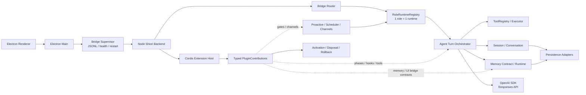

# TypeScript 后端目标架构与迁移边界

目标是新增 TypeScript/Node backend，最终替换 Python online runtime。迁移期间可以有 legacy bridge，但不能让 Python 和 Node 同时执行真实副作用。

## Owning boundaries

- Electron Main 只负责子进程监管、JSONL、health、超时、重启、退出和 IPC 安全。
- Shiori Core 拥有 Role、唯一角色 Session/Conversation、RoleRuntime、Agent 回合、Tool、Memory、主动回合、channel 路由、DesktopBridge handlers 和产品持久化语义。
- Cordis Host 只拥有插件发现、配置、依赖注入、依赖排序、激活、销毁和回滚。
- Plugin 通过统一 `/plugin` 入口声明 typed contributions，不直接拥有角色、会话或 renderer 数据权威。
- Persistence adapters 复用现有 workspace、SQLite、Markdown 和索引格式；必要 schema migration 必须版本化、幂等、可备份。
- LLM adapter 封装官方 OpenAI SDK 和 Responses API；Core 只依赖 Shiori 自己的 LlmProvider contract。

## 迁移顺序

1. 冻结 bridge、事件、错误码、数据路径和行为 trace。
2. 新增 Node app shell、JSONL stdin/stdout 和 health；renderer 协议不变。
3. 新增 Responses API provider 和无工具最小回合。
4. 迁移 RoleRuntime、Session、Conversation 和 persistence adapters。
5. 迁移 ToolRegistry、ToolExecutor、MCP 和工具 hook。
6. 迁移 Memory contract、默认 engine、embedding 和 consolidation。
7. 建立 Cordis Host 与 legacy plugin adapter，再逐个迁移插件。
8. 迁移 proactive、channels、DesktopBridge handlers、voice、image、Story 和 observation。
9. Node-only 切换，删除 Python online runtime、PyInstaller artifact 和 legacy forwarding。

## 不变量

- 一个角色对应一个唯一活跃会话和一个 role runtime。
- Responses `previous_response_id` 不能替代本地 Session/Conversation。
- Cordis context 不能成为角色、会话或记忆的权威状态。
- 迁移期间不能双写 memory、双发消息或双调外部副作用 API。
- renderer-facing RPC、事件名、流式事件和错误码先保持兼容。
