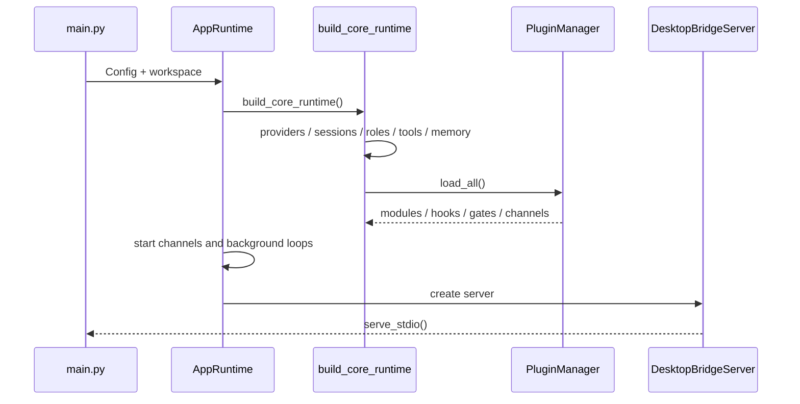

# 启动与关闭流程

## 当前启动



当前 Python bridge 的 readiness 由 Electron `DesktopBridgeClient` 轮询 `health` 完成。Node 迁移必须保持同样的 readiness、超时和 restart 语义。

## 当前关闭

```mermaid
sequenceDiagram
  participant App as AppRuntime
  participant Core as CoreRuntime
  participant Loop as AgentLoop / Scheduler / Bus
  participant Plugin as PluginManager
  participant Store as Memory / HTTP / Channels
  App->>Loop: stop and cancel
  App->>Loop: await background tasks
  App->>Core: stop()
  Core->>Plugin: terminate_all()
  Core->>Core: MCP shutdown / EventBus close
  App->>Store: stop IPC / channels / memory / HTTP
```

RoleRuntime 关闭必须先停止接收新工作，再取消并等待 active work；active work 未归零时不能静默结束。
